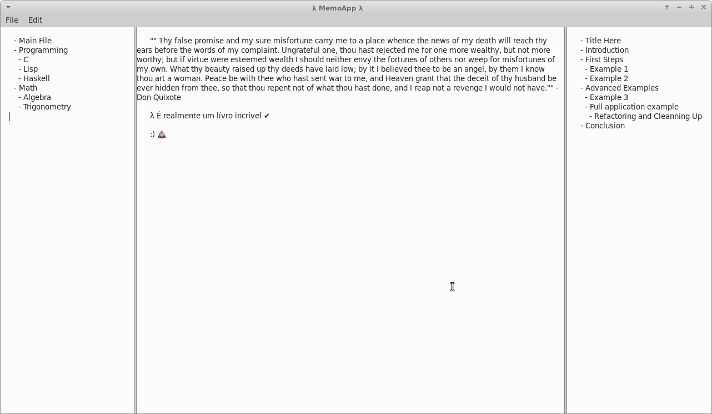

= MemoApp
:toc:
:sectnums:

== Intro and Initial Notes

NOTE: The official repository for this project is on GitLab. Check it link:https://gitlab.com/fernandobasso/memoapp[here].

This is MemoApp, an application that attempts to be similar to Zim Wiki, but using Markdown as the underlying language.

NOTE: For now, the devel branch is where the cool stuff takes place. This program is not in an usable state as of yet. I'm working on it, though.

Future ideas may involve supporting extra stuff not present in Markdown, perhaps something like Asciidoctor, and even far in the future, include features found in Anki for flashcard-related stuff.

The main intended features for the near future are these:

- Top Menu Bar.
- Tree View (left). A list of documents in the “project”.
- Main Editing Window (center).
- Headings and index of main elements of current editing view (right).
- Very searchable and navigable.
- Markdown behind the scenes, with a simple WYSIWYG editor, if it proves possible.

== Screenshots

NOTE: The text in the image above is hard-coded, just so we have something where to move forward from.

== Git Guidelines

Start commit subject messages with one of these:

- `feat`: implement a feature.
- `minor`: for minor, trivial stuff.
- `poc`: prof of concept attempt.
- `fix`: fix something like spelling.
- `ref`: refactoring.
- `doc`: related do documentation.

== Dev Setup

NOTE: Instead of using an IDE (gnome-builder, anjuta, etc) with a ready (and sometimes bloated) gtk application template, I decided to do things step-by-step, learning along the way and setting things up as needed, keeping everything as minimal and simple as possible.

Make sure the Gtk (3) dev stuff is installed. On Arch Linux, the header files are always packaged with the program/lib they relate to. For example, if Gtk is installed, you are ready to develop and compile Gtk applications because that package contains the header files and installs them under `/usr/include/` subdirectories. On a Debian-based distro, one generally needs to install the _-dev_ packages, like `libgtk-3-dev` or something like that.

NOTE: As of now, I am thinking of maitaining two build setups, one with Meson and Ninja, and the other with good old Makefiles. The reason is two fold: learn and practice both ways of building C/Gtk projects, and also because I do not know yet which one gives less trouble in the long run.

=== Compiling with Ninja and Meson

.building and running
[source,shell-session
----
$ ninja -C build
$ ./build/meson-out/memoapp
----

=== Compiling with make

Basically, we need to translate the UI resources to a `.c` file and then run compile everything. Take a look at the `Makefile`.

.building and running
[source,shell-session]
----
$ make clean
$ make gresoures
$ make all
$ ./memoapp

# Or, to run with Gtk Inspector:
GTK_DEBUG=interactive ./memoapp
----

When UI descriptions are changed, we should validate them, for example:

[source,shell-session]
----
$ gtk-builder-tool validate src/ui/memoapp-window.ui
----

The `ui-resource.c` file only needs to be regenerated if an UI or XML resource file is modified.

There are link:https://developer.gnome.org/gtk3/stable/gtk-running.html[docs on compiling and debugging Gtk apps^].

=== Vim

It looks like ALE and YCM were both doing linting. Disabled ALE for now and YCM is indeed doing some linting on its own. `.ycm_extra_conf.py` barely configured with Gtk stuff.

For CCLS, in Vim, run `:CocConfig` and paste this:

[source,json]
----
{
  "languageserver": {
    "ccls": {
      "command": "ccls",
      "filetypes": ["c", "cpp", "cuda", "objc", "objcpp"],
      "rootPatterns": [".ccls-root", "compile_commands.json"],
      "initializationOptions": {
        "cache": {
          "directory": ".ccls-cache"
        },
        "client": {
          "snippetSupport": true
        },
        "compilationDatabaseDirectory": "builddir"
      }
    }
  },
  "python.jediEnabled": false
}
----

=== VSCode

Yes, VSCode seems to be doing a good job with C. The link:https://code.visualstudio.com/docs/languages/cpp[C/C++] extension is working fine for me, on Arch Linux! Semantic completion is working fine, and hovering over stuff shows documentation about it! I added  C/Gtk stuff in the extension's include path configuration, though, in VSCode's `settings.json`.

[source,json]
----
"C_Cpp.default.includePath": [
    "/usr/include/gtk-3.0",
    "/usr/include/pango-1.0",
    "/usr/include/glib-2.0",
    "/usr/lib/glib-2.0/include",
    "/usr/lib/libffi-3.2.1/include",
    "/usr/include/harfbuzz",
    "/usr/include/fribidi",
    "/usr/include/freetype2",
    "/usr/include/libpng16",
    "/usr/include/cairo",
    "/usr/include/pixman-1",
    "/usr/include/gdk-pixbuf-2.0",
    "/usr/include/libmount",
    "/usr/include/blkid",
    "/usr/include/gio-unix-2.0",
    "/usr/include/atk-1.0",
    "/usr/include/at-spi2-atk/2.0",
    "/usr/include/at-spi-2.0",
    "/usr/include/dbus-1.0",
    "/usr/lib/dbus-1.0/include"
],
----

It is basically the same stuff in `.ycm_extra_conf`, which is basically the include lines (the ones starting with `-I`) output of this command:

[source,shell-session]
----
$ pkg-config \
  --cflags \
  | sed 's/ /\n/g' \
  | grep -- -I \
  | sed 's/^\(.*\)$/"\1",/g'
----

Check the link:https://developer.gnome.org/gtk3/stable/gtk-compiling.html[docs on compiling Gtk apps^].

